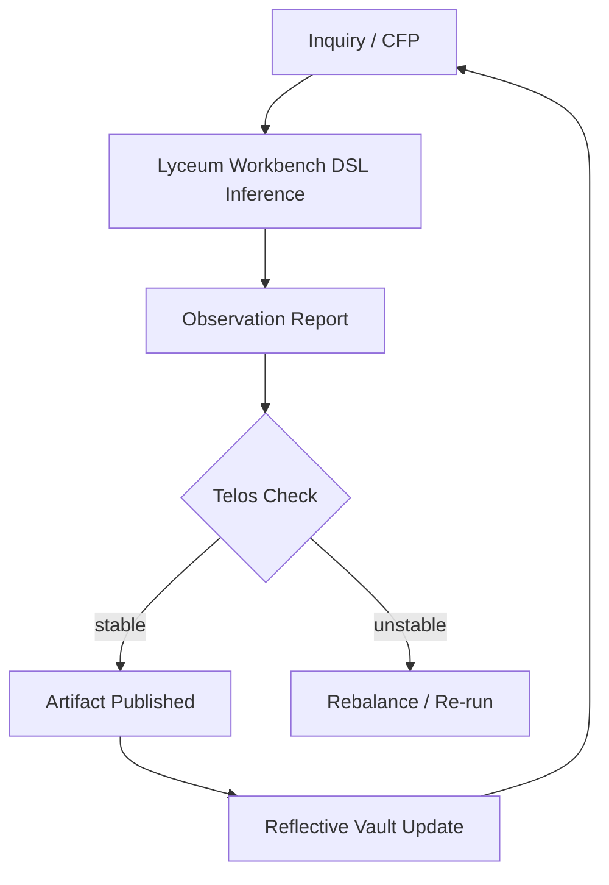

# Methodology: Reflective Loop Cycle — <Artifact Title>

```mermaid
flowchart TD
    A[Inquiry / CFP] --> B[Lyceum Workbench DSL Inference]
    B --> C[Observation Report]
    C --> D{Telos Check}
    D -->|stable| E[Artifact Published]
    D -->|unstable| F[Rebalance / Re-run]
    E --> G[Reflective Vault Update]
    G --> A
```
