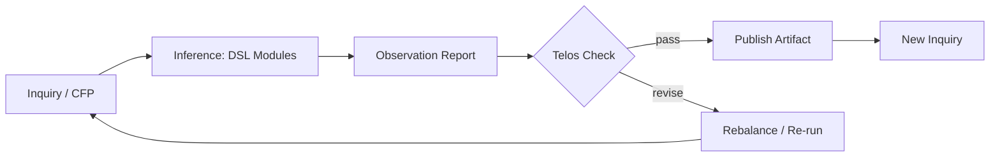

# Artifacts of Reflective Computing

!!! info "About this Section"
    The **Artifacts** section of *Leo’s Lyceum Vault* collects concrete outputs of **Reflective Computing** — each one a complete cycle of *inquiry → inference → observation → reintegration*.

## 📜 Current Artifacts

### 🪞 Reflective Karakuri
> *“Designing AI Systems that Integrate Japanese Asobi Craftsmanship and Naikan-Based Self-Reflection for Moral Feedback Symmetry.”*

- **Overview:** A cross-cultural study of reflective AI inspired by *asobi* aesthetics and *karakuri ningyō* craftsmanship.
- **Core DSL Modules:** `AristotleFourCauses`, `TradeoffLens`, `SyntheticNaikan`
- **Files:**
  - [CFP](../reflective-karakuri/2025-Reflective-Karakuri-CFP.md)
  - [Observation Report](../reflective-karakuri/2025-Reflective-Karakuri-ObservationReport.md)
  - [Methodology](../reflective-karakuri/methodology.md)
- **Purpose:** Demonstrates how Reflective Computing unites philosophical introspection with algorithmic architecture.
- **Status:** ✅ Published 2025

## 🧩 Future Artifacts

=== "Template"
    - **Overview:** [Template README](../artifact-template/index.md)
    - **CFP:** [Template CFP](../artifact-template/<ARTIFACT>-CFP.md)
    - **Observation Report:** [Template Observation Report](../artifact-template/<ARTIFACT>-ObservationReport.md)
    - **Methodology:** [Template Methodology](../artifact-template/methodology.md)

=== "Planned"
    - **Synthetic Naikan Extensions** — Applying Naikan loops to multi-agent reflection.
    - **Aristotelian Organism** — Causal ontology for music and AI composition.
    - **Dialectic Ecosystem** — Mapping co-emergent reasoning between human and machine actors.

## 📚 How to Read These Artifacts

Each artifact contains three structural documents:

| File | Purpose |
|------|----------|
| `*-CFP.md` | The **conceptual seed** — a “Call for Paper” style question defining the reflective inquiry. |
| `*-ObservationReport.md` | The **AI deduction output** generated by the DSL chain within Lyceum Workbench. |
| `methodology.md` | The **reflective mirror**, documenting how insights are re-integrated into the Vault. |

## 🔄 Artifact Lifecycle

